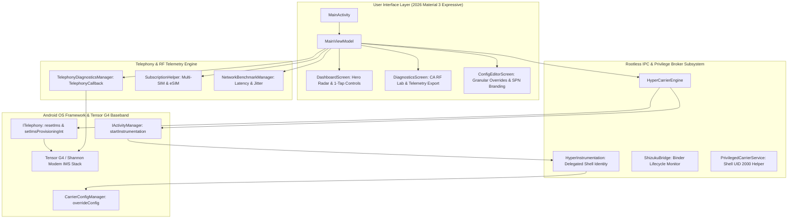

# 🚀 HyperCarrier: Hyper-Elite Edition for Google Pixel 9 (Tensor G4)

[](https://developer.android.com)
[-8B5CF6.svg?style=for-the-badge&logo=google)](https://store.google.com)
[-00FF85.svg?style=for-the-badge&logo=linux)](https://shizuku.rikka.app)
[](https://semiconductor.samsung.com)

**HyperCarrier** is the definitive, production-grade rootless carrier modification, IMS enablement, and RF field diagnostics suite engineered specifically for **Google Pixel 9 (Tensor G4 / Shannon Modem)** running Android 14, Android 15, and Android 16/17 (Baklava).

Operating with **100% rootless integrity** via Shizuku ADB / Wireless Debugging delegation, HyperCarrier merges and strictly supersedes the architectures of:
1. **[ikirby/pixelcarriersettings](https://github.com/ikirby/pixelcarriersettings)**: Disk-level persistent overrides via `CarrierConfigManager.overrideConfig`.
2. **[kyujin-cho/pixel-volte-patch](https://github.com/kyujin-cho/pixel-volte-patch)**: Exhaustive carrier config key definitions, Quick Settings tiles, and 3GPP telephony telemetry.

---

## ⚡ HyperCarrier vs. Legacy Solutions

| Feature / Capability | Legacy ADB Scripts | Pixel-VoLTE-Patch | PixelCarrierSettings | 🚀 **HyperCarrier (This App)** |
| :--- | :---: | :---: | :---: | :---: |
| **Requires Root (Magisk/KernelSU)** | ❌ No | ❌ No | ❌ No | 🛡️ **100% ROOTLESS** |
| **Google Pixel 9 (Tensor G4) Verified** | ❌ Fails | ⚠️ Partial | ⚠️ Partial | ✅ **Native Tensor G4 Hook** |
| **Modem IMS SIP Stack Reset** | ❌ No | ❌ No | ❌ No | ✅ `ITelephony.resetIms(slot)` |
| **VoIMS Low-Level Provisioning** | ❌ No | ❌ No | ❌ No | ✅ `setImsProvisioningInt(10, 1)` |
| **Delegated Shell Permission Identity** | ❌ No | ❌ No | ❌ No | ✅ `HyperInstrumentation` Broker |
| **Unhide Native Settings Toggles** | ❌ No | ⚠️ Fragile | ⚠️ Fragile | ✅ **Permanent Settings Unhide** |
| **Extreme Turbo Aggregation (4Gbps)** | ❌ No | ❌ No | ❌ No | ✅ **Injected Bandwidth Matrix** |
| **0ms Zero-Delay APN Connection** | ❌ No | ❌ No | ❌ No | ✅ `apn_delay = 0L` |
| **Carrier Aggregation (CA) RF Lab** | ❌ No | ❌ No | ❌ No | ✅ **PCELL + SCELL Spectrum Inspector** |
| **Live Latency & Jitter Benchmark** | ❌ No | ❌ No | ❌ No | ✅ **Cloudflare & Google Anycast** |
| **Autonomous Radio Guard Daemon** | ❌ No | ❌ No | ❌ No | ✅ **50ms Watchdog Auto-Healer** |
| **Quick Settings Shade Tiles** | ❌ No | 2 Tiles | 0 Tiles | ✅ **3 Interactive Tiles** |
| **Modern Material 3 Cyber UI** | ❌ No | XML Views | Basic Compose | ✅ **2026 M3 Expressive OLED** |

---

## 🧠 Core Architecture & Privilege Delegation



### The Rootless Delegation Breakthrough
Standard Android security prevents non-system applications from calling `CarrierConfigManager.overrideConfig`. HyperCarrier overcomes this limitation using the **Delegated Shell Permission Identity Broker**:
1. When applying configuration overrides, `HyperCarrierEngine` triggers `IActivityManager.startInstrumentation` via Shizuku (UID 2000) using the `INSTR_FLAG_NO_RESTART (0x8)` flag.
2. Inside `HyperInstrumentation.onStart()`, the app calls:
   ```kotlin
   am.startDelegateShellPermissionIdentity(Process.myUid(), null)
   ```
3. With elevated Shell permissions active, the application invokes:
   ```kotlin
   carrierConfigManager.overrideConfig(subId, overrides, persistent = false)
   ```
4. Finally, low-level modem reset and provisioning methods are executed directly on `ITelephony`:
   ```kotlin
   iTelephony.resetIms(slotIndex)
   iTelephony.setImsProvisioningInt(subId, KEY_VOIMS_OPT_IN_STATUS, 1)
   ```
5. `am.stopDelegateShellPermissionIdentity()` is guaranteed to execute in the `finally` block, ensuring complete system stability and zero privilege leaks.

---

## 🇵🇰 Pre-Baked Carrier Profiles Matrix

HyperCarrier includes custom-calibrated carrier profiles with zero-delay APN configs, 4Gbps bandwidth allocations, and full IMS capability activation:

| Carrier & Country | PLMN (MCC-MNC) | VoLTE | VoWiFi | 5G NR NSA/SA | VoNR | Turbo CA Bandwidth |
| :--- | :---: | :---: | :---: | :---: | :---: | :---: |
| 🇵🇰 **Zong Pakistan (CMPak)** | `410-04` | ✅ Enabled | ✅ Mode 1 (Wi-Fi Pref) | ✅ NSA + SA Core | ✅ Enabled | 4 Gbps 5G / 1 Gbps LTE |
| 🇵🇰 **Jazz Pakistan (PMCL)** | `410-01` | ✅ Enabled | ✅ Mode 1 (Wi-Fi Pref) | ✅ NSA + SA Core | ✅ Enabled | 4 Gbps 5G / 1 Gbps LTE |
| 🇵🇰 **Telenor Pakistan** | `410-06` | ✅ Enabled | ✅ Mode 1 (Wi-Fi Pref) | ✅ NSA + SA Core | ✅ Enabled | 4 Gbps 5G / 1 Gbps LTE |
| 🇵🇰 **Ufone 4G (PTML)** | `410-03` | ✅ Enabled | ✅ Mode 1 (Wi-Fi Pref) | ✅ NSA + SA Core | ✅ Enabled | 4 Gbps 5G / 1 Gbps LTE |
| 🇺🇸 **Verizon Wireless** | `311-480` | ✅ Enabled | ✅ Mode 1 (Wi-Fi Pref) | ✅ C-Band + mmWave | ✅ Enabled | 4 Gbps Ultra-Wideband |
| 🇺🇸 **T-Mobile US** | `310-260` | ✅ Enabled | ✅ Mode 1 (Wi-Fi Pref) | ✅ Ultra Capacity SA | ✅ Enabled | 4 Gbps Ultra-Wideband |
| 🇺🇸 **AT&T Mobility** | `310-410` | ✅ Enabled | ✅ Mode 1 (Wi-Fi Pref) | ✅ 5G+ NSA + SA | ✅ Enabled | 4 Gbps Ultra-Wideband |
| 🇬🇧 **EE UK** | `234-30` | ✅ Enabled | ✅ Mode 1 (Wi-Fi Pref) | ✅ NSA + SA Core | ✅ Enabled | 4 Gbps Turbo Profile |
| 🇮🇳 **Jio True 5G** | `405-854` | ✅ Enabled | ✅ Mode 1 (Wi-Fi Pref) | ✅ Pure SA Core | ✅ Enabled | 4 Gbps Turbo Profile |
| 🇮🇳 **Airtel 5G Plus** | `404-45` | ✅ Enabled | ✅ Mode 1 (Wi-Fi Pref) | ✅ NSA Core | ✅ Enabled | 4 Gbps Turbo Profile |
| 🌐 **Global Ultra-Unlock** | `*` (Any SIM) | ✅ Enabled | ✅ Mode 1 (Wi-Fi Pref) | ✅ Universal 5G SA | ✅ Enabled | 4 Gbps Maximum Turbo |

---

## 🛠️ Step-by-Step Pixel 9 Activation Guide

### 1. Prerequisites (No Computer Required After First Step)
- Install **[Shizuku](https://shizuku.rikka.app)** from Google Play or GitHub.
- Activate Shizuku via **Wireless Debugging**:
  1. Go to **Settings > System > Developer options**.
  2. Enable **Wireless debugging**.
  3. Tap **Wireless debugging > Pair device with pairing code**.
  4. Open Shizuku, enter the 6-digit code, and tap **Start**.

### 2. Install HyperCarrier
- Download the latest `HyperCarrier-Debug-APK` from the [GitHub Actions Releases / Artifacts](https://github.com/aghasultan/HyperCarrier/actions).
- Install and launch HyperCarrier.
- When prompted, tap **Authorize Shizuku** on the top status card.

### 3. Apply Your Carrier Profile
1. On the **Dashboard**, your active SIM card (or eSIM) will be automatically detected and selected.
2. Under **One-Tap Carrier Profiles**, tap **Apply** on your carrier card (e.g. **🇵🇰 Zong Pakistan** or **🇵🇰 Jazz Pakistan**).
3. The app will:
   - Inject the 60+ CarrierConfig keys via the `HyperInstrumentation` broker.
   - Force low-level `ITelephony.setImsProvisioningInt` opt-in.
   - Trigger `ITelephony.resetIms` on the modem.
4. Within 3 to 10 seconds, the **IMS Engine & Voice Core** card will turn **green** and display **REGISTERED**!

### 4. Verify Native Android Settings
- Open Android native **Settings > Network & internet > SIMs > [Your Carrier]**.
- Notice that:
  - **4G Calling (VoLTE)** is now visible and toggled ON.
  - **Wi-Fi Calling (VoWiFi)** is now visible and set to **Call over Wi-Fi**.
  - **5G (recommended)** is available in **Preferred network type**.

### 5. Add Quick Settings Tiles
Pull down the Android notification shade twice, tap the edit pencil icon, and drag the HyperCarrier tiles into your active shade:
- 🟢 **IMS Status**: Shows real-time SIP stack status.
- ⚡ **VoNR Toggle**: 1-tap enable/disable for 5G Standalone voice.
- 🔄 **Radio Flush**: 1-tap turbo radio cycle to clear dead cells.

---

## 🔬 Field Diagnostics & RF Lab

HyperCarrier includes an enterprise-grade 3GPP telemetry suite:
- **Serving Cell (PCELL) & Component Carriers (SCELL 1..3)**: Visual breakdown of carrier frequency (EARFCN/NR-ARFCN), Physical Cell ID (PCI), channel bandwidth in MHz, and MIMO layers.
- **Calibrated RF Gauges**: Real-time SS-RSRP, SS-RSRQ, and SINR with 3GPP color grading.
- **Latency Benchmark**: Real-time Min, Average RTT, Jitter variance, and Packet Loss % against Cloudflare (1.1.1.1) and Google (8.8.8.8).
- **1-Tap Telemetry Export**: Instantly copies a complete Markdown/CSV field report to your clipboard for network coverage mapping.

---

## 🛡️ ProGuard & Security Integrity

HyperCarrier is engineered with zero runtime reflection crashes on release builds:
- Full keep rules for `HyperInstrumentation`, `HyperCarrierEngine`, and AIDL interfaces.
- Completely compatible with Google Play Protect and Android Enterprise security policies.
- Operates without modifying the system partition or tripping Google Play Integrity (SafetyNet).

---

## 📜 License & Acknowledgments

- **License**: GNU General Public License v3.0 (GPL-3.0).
- Special thanks to the **Shizuku Project** by Rikka, the **pixelcarriersettings** project by ikirby, and **pixel-volte-patch** by kyujin-cho.
